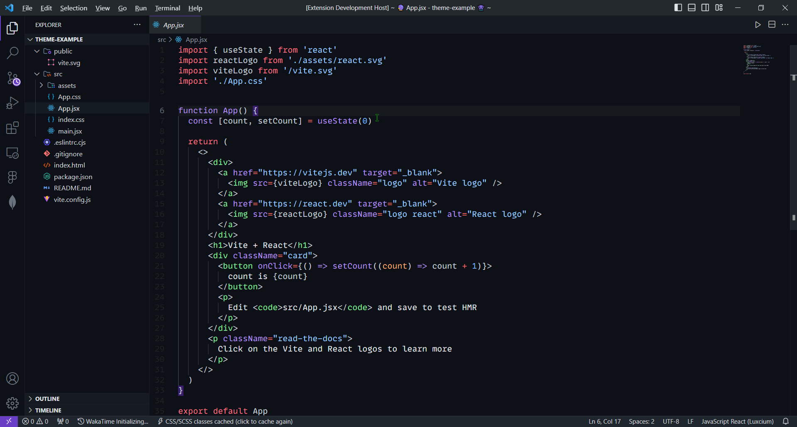

# 👾 Github Purple Refined

A theme as accurate to Github's dark theme as possible, but with purple accents!

## 🚀 Installation

- Open the Extensions sidebar in VS Code
- Search for `Github Purple Refined`
- Click Install
- Open the Command Palette with `Ctrl+Shift+P` or `⇧⌘P`
- Select Preferences: Color Theme and choose `Github Purple Refined`.

All credits to the original theme that I forked from [Github Purple](https://marketplace.visualstudio.com/items?itemName=4a454646.github-purple) developer.

> 💜 With Love by Rnbsov 👾
